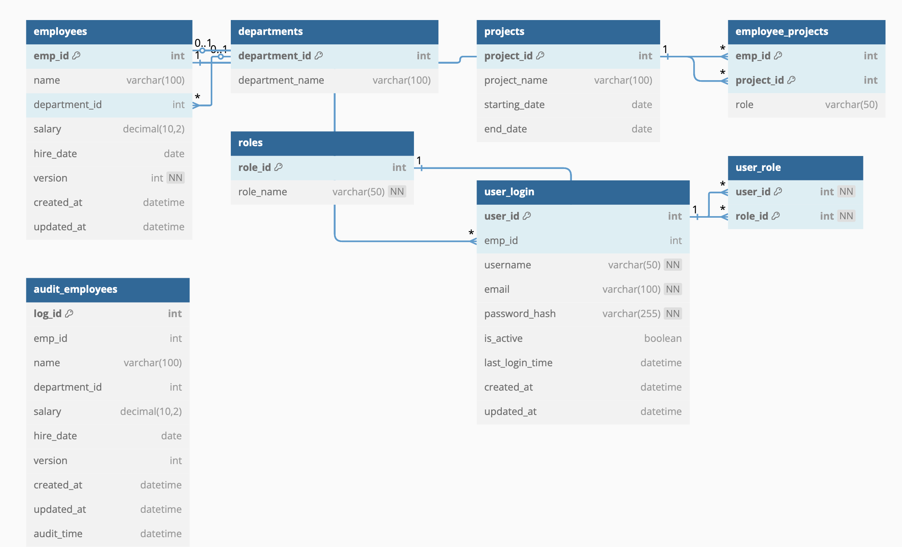
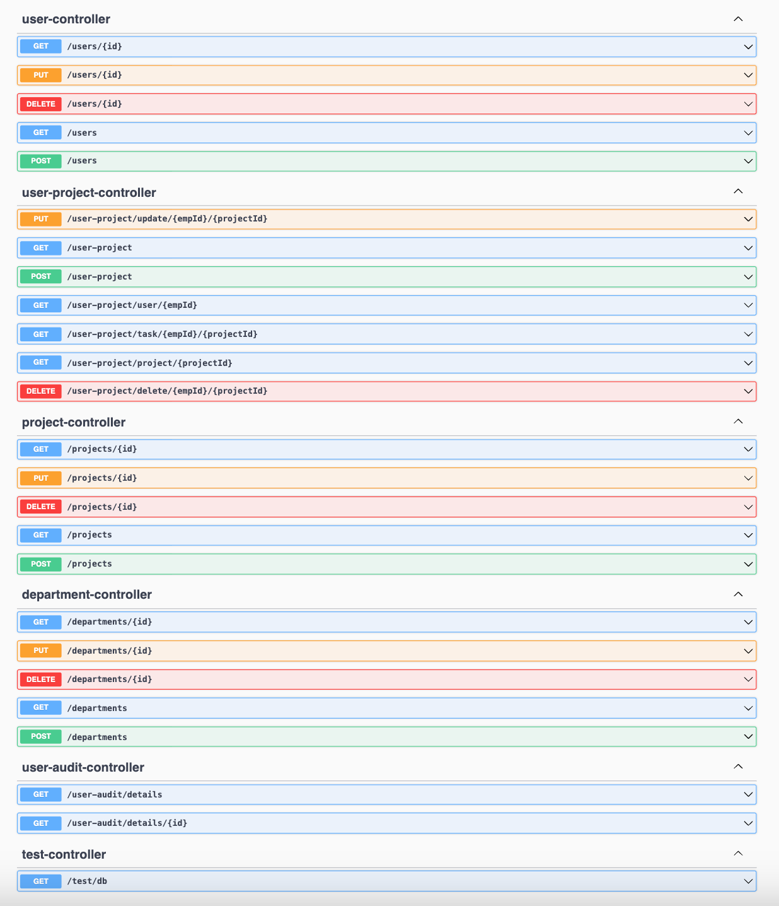

## Utilizing Spring Hibernate-JPA
Build a complete organizational system where employees and projects can be efficiently managed.

## Database Design

https://dbdiagram.io/d/682107db5b2fc4582f1e8f66

## API Documentation

http://localhost:8093/swagger-ui/index.html

## Tech stack
Spring Boot 3.2+, JAVA-17, MS SQL Server

